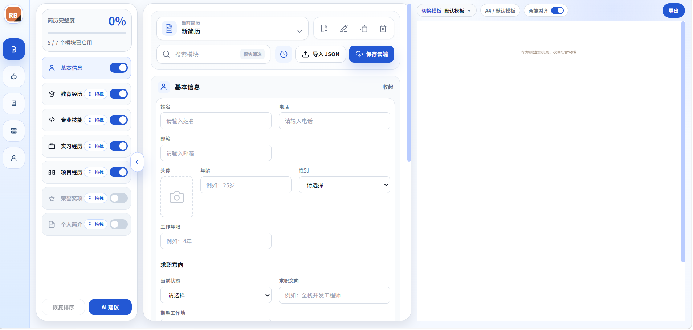
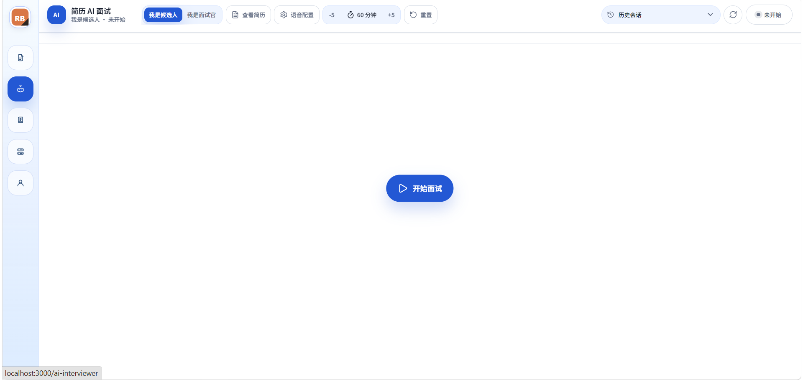
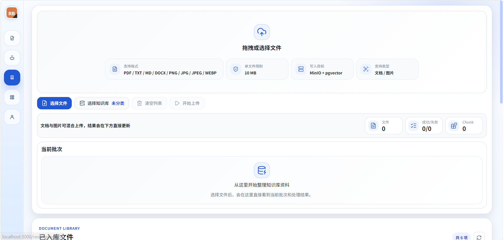
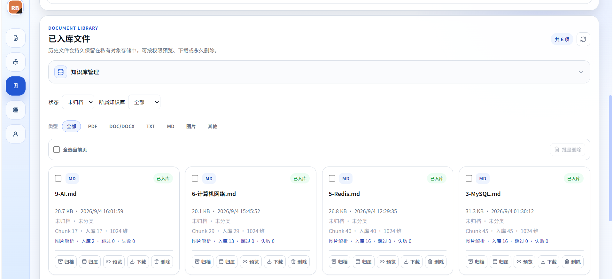
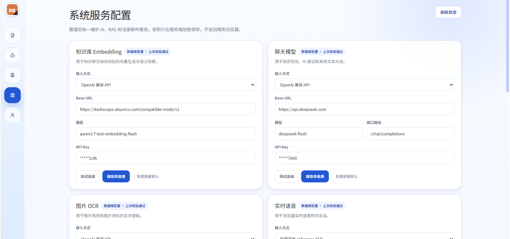

# AI Resume Builder

面向求职场景的 AI 简历平台：简历编辑与多模板导出、AI 按模块优化、AI 模拟面试（含实时语音），以及基于 pgvector 的 RAG 知识库检索。配套一套独立的端到端质量保障工程。

前端为 Vue 3 + TypeScript 单页应用，AI 能力由独立的 Python FastAPI 后端提供，Docker Compose 一键部署。


## 仓库内容

| 目录 | 内容 | 文档 |
| --- | --- | --- |
| [`AI-Resume-Builder/`](AI-Resume-Builder/) | 业务实现：Vue 3 前端、Python AI 后端、数据库迁移 | [业务 README](AI-Resume-Builder/README.md) |
| [`AI-Resume-Builder-QA/`](AI-Resume-Builder-QA/) | 质量保障：接口自动化、Mock AI 契约、面试流式边界、UI 场景、性能对比 | [QA README](AI-Resume-Builder-QA/README.md) |

两者原为各自独立的仓库，合并进本仓库时各自的提交历史完整保留，各带一层子目录。

## 核心结果

图片解析链路由**同步串行**改为**异步并发**，同一台机器、同一批语料、各 10 次正式样本的对照：

| 指标 | 同步串行 | 异步并发 | 变化 |
| --- | --- | --- | --- |
| 上传至解析完成（均值） | 34.78 秒 | 15.76 秒 | −54.7% |
| 上传至解析完成（中位数） | 32.33 秒 | 14.61 秒 | — |
| 解析吞吐 | 8.06 张/分钟 | 16.47 张/分钟 | +104.5% |

50 张图片全部成功入库，数据库终态校验通过，失败 0。以上为单机单轮小样本对照，**不构成容量推断**；完整口径、原始报告与复现方式见 [QA 仓库](AI-Resume-Builder-QA/README.md)。

## 系统结构

```text
浏览器（Vue 3 SPA）
   │  HTTP / SSE
   ▼
FastAPI AI 后端（api → application → domain → infrastructure 分层）
   ├─ MySQL 8          账号、简历、面试会话
   ├─ PostgreSQL 17    知识库向量与检索（pgvector）
   ├─ Redis            实时语音一次性票据、图片增强队列
   ├─ MinIO            知识库原始文件（私有 Bucket）
   └─ OpenAI 兼容接口   Chat / Embedding / Vision OCR / Realtime
```

## 界面预览

### 简历编辑



### AI 面试



### 知识库上传



### 文档库管理



### 系统服务配置



## 功能概览

- **账号与权限**：注册、加密登录、邮箱验证码、密码重置，以及基于角色的功能权限控制。
- **简历管理**：新建、切换、复制、重命名、删除，自动保存与手动保存。
- **简历编辑**：按模块编辑、显示隐藏、拖拽排序，编辑器与预览实时联动，适配移动端。
- **模板与导出**：内置 9 套简历模板，支持 PDF、Markdown、JSON 导出与 JSON 导入。
- **AI 优化**：按简历模块生成优化建议与优化内容，可直接应用到简历。
- **AI 面试**：候选人模拟面试与面试官追问两种模式，支持语音输入、会话历史和结束评分。
- **RAG 知识库**：文档或图片经 OCR、结构化切块与 Embedding 后写入 pgvector；支持知识库分组、文档归档与面试会话的检索范围限定。
- **系统服务配置中心**：管理员在网页配置 AI 与邮件服务，密钥以 AES-GCM 加密入库。

## 工程要点

- **分层后端**：`api / application / domain / infrastructure` 四层，领域层不依赖具体存储实现。
- **版本化迁移**：Flyway 管理 MySQL 与 PostgreSQL 两套迁移，启动脚本与 CI 均先跑迁移、通过后才拉起服务。
- **检索作用域**：知识库归属、归档状态与检索范围过滤都在向量排序与 LIMIT **之前**生效，避免"先取 TopK 再过滤"导致的召回塌陷。
- **隔离的测试栈**：QA 使用独立容器、网络、端口与数据卷，不连接业务库；写入类用例受开关控制，并按运行 ID 精确清理、逐轮校验残留。
- **契约先行的 Mock**：内置 OpenAI 兼容 Mock AI 服务，让接口与面试链路的自动化不依赖真实模型与网络。

## 技术栈

| 层次 | 技术 |
| --- | --- |
| 前端 | Vue 3、TypeScript、Pinia、Vite、Tailwind CSS |
| AI 后端 | Python 3.11+、FastAPI、Uvicorn |
| 业务数据库 | MySQL 8 |
| 向量数据库 | PostgreSQL 17 + pgvector |
| 缓存与队列 | Redis |
| 对象存储 | MinIO |
| 数据库迁移 | Flyway |
| AI 能力 | OpenAI 兼容的 Chat、Embedding、Vision OCR、Realtime |
| 质量保障 | pytest、httpx、pytest-playwright、Locust、DeepEval |

## 快速开始

### 启动业务栈

```powershell
cd AI-Resume-Builder
copy .env.docker.example .env      # 填写 .env 中标注为必需的项目
.\start-docker-python-ai.bat
```

脚本会依次执行数据库迁移、MinIO 初始化、后端与前端启动，并等待健康检查通过。启动后访问 `http://localhost:3000`（前端）与 `http://localhost:8999/docs`（接口文档）。

环境变量清单、本地开发方式与端口约定见 [业务 README](AI-Resume-Builder/README.md)。

### 启动 QA 栈并跑回归

```powershell
cd AI-Resume-Builder-QA
python -m venv .venv
.\.venv\Scripts\python.exe -m pip install -e ".[test]"
.\scripts\start_qa.ps1
.\scripts\run_regression.ps1
```

测试类型、pytest 标记与单类运行命令见 [QA README](AI-Resume-Builder-QA/README.md)。

## 说明

- 本仓库只保留源码、配置模板与公开文档；本地测试数据、运行报告、内部设计稿与环境文件不纳入版本控制，相关路径见根目录及各子目录的 `.gitignore`。
- 本项目为个人项目，暂未附开源许可；如需引用或复用请先联系作者。
