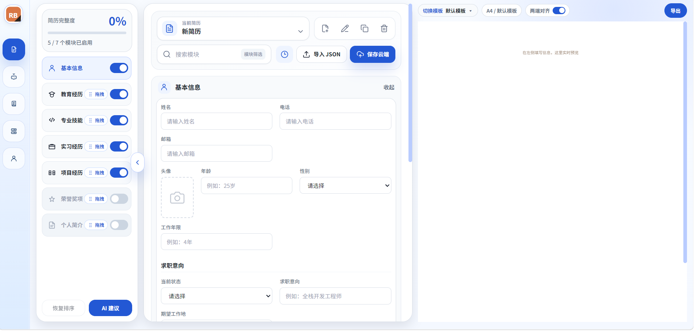
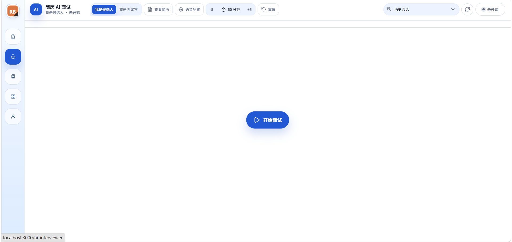
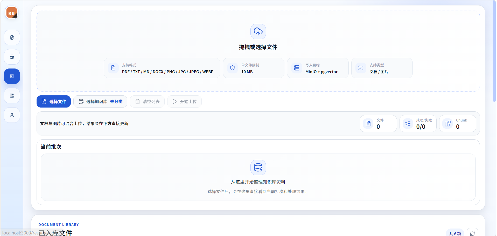
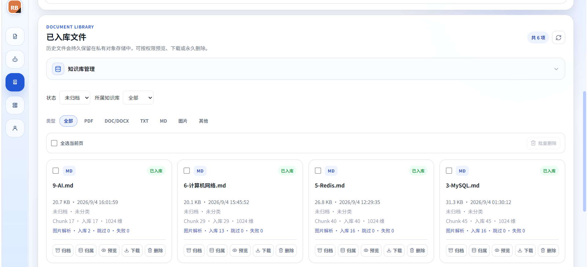
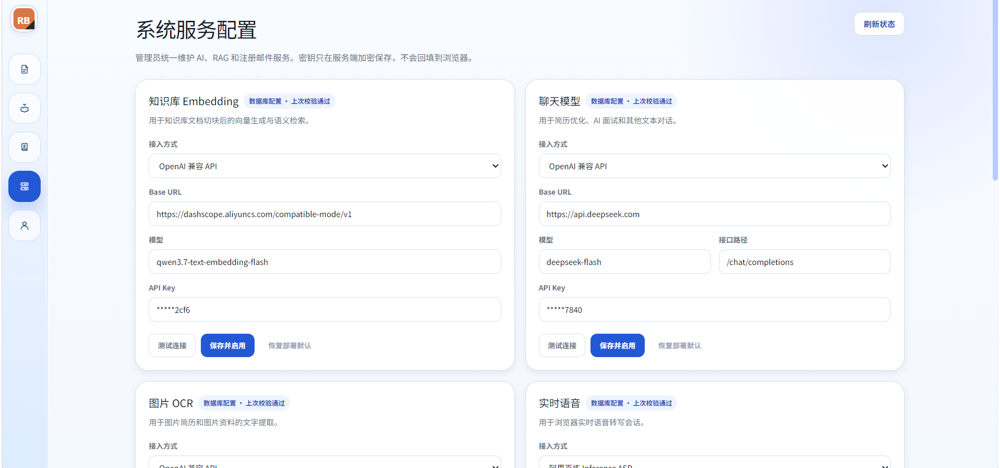

# AI Resume Builder

面向求职场景的 AI 简历平台：简历编辑与多模板导出、AI 按模块优化、AI 模拟面试（含实时语音），以及基于 pgvector 的 RAG 知识库检索。配套一套独立的端到端质量保障工程。

前端为 Vue 3 + TypeScript 单页应用，AI 能力由独立的 Python FastAPI 后端提供，Docker Compose 一键部署。


## 仓库内容

| 目录                                               | 内容                                      | 文档                                          |
| ------------------------------------------------ | --------------------------------------- | ------------------------------------------- |
| [`AI-Resume-Builder/`](AI-Resume-Builder/)       | 业务实现：Vue 3 前端、Python AI 后端、数据库迁移        | [业务 README](AI-Resume-Builder/README.md)    |
| [`AI-Resume-Builder-QA/`](AI-Resume-Builder-QA/) | 质量保障：接口自动化、Mock AI 契约、面试流式边界、RAG 与 AI 面试质量评测、性能对比 | [QA README](AI-Resume-Builder-QA/README.md) |

两者原为各自独立的仓库，合并进本仓库时各自的提交历史完整保留，各带一层子目录。

## 核心结果

图片解析链路由**同步串行**改为**异步并发**（Worker 并发 3），同机同语料、真实模型对照。运行条件：Windows 11 / 12 逻辑 CPU；输入为内嵌 5 图的固定 PDF（`imageSha256` 两组一致，排除输入漂移）；vision 模型 `deepseek-flash`；每组 10 个正式样本（另有 2 个预热样本，不计入统计）。

| 指标                                      | 同步串行      | 异步并发       | 变化          |
| --------------------------------------- | --------- | ---------- | ----------- |
| 上传至解析完成 · 均值 `total_to_image_parsed_ms` | 34.78 秒   | 15.76 秒    | **−54.7%**  |
| 上传至解析完成 · 中位数                           | 32.33 秒   | 14.61 秒    | −54.8%      |
| 上传至解析完成 · P95                           | 52.25 秒   | 28.65 秒    | −45.2%      |
| 解析吞吐 `imagesPerSecond`                  | 8.06 张/分钟 | 16.47 张/分钟 | **+104.5%** |
| 等价平均单张耗时                                | 7.45 秒    | 3.64 秒     | −51.1%      |
| 上传接口响应 · 均值 `upload_request_ms`         | 34.77 秒   | 0.52 秒     | 不可比         |
| 上传接口响应 · 中位数                            | 32.33 秒   | 0.51 秒     | 不可比         |
| 上传接口响应 · P95                            | 52.25 秒   | 0.56 秒     | 不可比         |

正确性与完整性核验（两组均通过）：

| 项                                         | 同步串行               | 异步并发               |
| ----------------------------------------- | ------------------ | ------------------ |
| 成功入库图片数                                   | 50                 | 50                 |
| 数据库逐篇核验                                   | passed             | passed             |
| 文档终态                                      | 12 篇全部 `completed` | 12 篇全部 `completed` |
| 每篇 `indexedCount`                         | 均为 5               | 均为 5               |
| `failedCount` / `duplicateChunkCount`     | 0 / 0              | 0 / 0              |
| Locust 失败数 / 样本缺失数                        | 0 / 0              | 0 / 0              |
| 异步队列峰值 `pendingPeak` / `streamLengthPeak` | 不适用（无队列）           | 1 / 1，收尾归零         |

表中 `upload_request_ms` 两版语义不同（同步版含图片处理，异步版只到上传流结束），不可横向比较；正式口径为 `total_to_image_parsed_ms`，P95 在 10 个样本下即该组最大值。本轮为单轮、单机、单语料对照，不构成容量推断。

原始报告与逐样本明细：[`formal-ab-20260912a/VERIFICATION.md`](AI-Resume-Builder-QA/reports/performance/image-parser/formal-ab-20260912a/VERIFICATION.md)（含 `comparison.csv`、两组 `summary.json`、`samples.jsonl`、Locust 统计与队列采样）。

## RAG 检索与 AI 面试质量评测

质量评测分别检查检索结果能否找到相关资料，以及面试回答是否有依据、是否切题，用于分析切块、检索与回答生成中的问题。

| 评测对象 | 方法 | 指标与输出 |
| --- | --- | --- |
| RAG 检索 | 固定文档片段快照，为每道题标注相关片段 ID；将查询返回的片段映射到快照，与相关性标注（qrels）比较 | Recall@K、实际返回 Precision、MRR；输出逐题 JSONL、CSV 明细与 JSON 汇总 |
| AI 面试回答 | 采集实际传入回答模型的上下文和生成回答，通过 DeepEval 与 Judge 模型评判，并单独审查拒答、澄清等情况 | Faithfulness（回答是否有上下文依据）、Answer Relevancy（回答是否切题）、逐题判分理由与异常记录 |

RAG 检索采用 `chunk-qrels-v1` 固定片段评分，指标计算不调用 Judge。面试评测支持复用已保存的回答与上下文重跑 Judge，并合并分批评分结果，便于核查评分变化。

Mock AI 用于接口回归；真实质量评测需要配置真实模型，并准备本地数据集和相关性标注。数据集与原始报告保留在本地，克隆代码后需另行准备。评测流程、指标定义和运行要求见 [RAG 质量评测说明](AI-Resume-Builder-QA/quality/README.md)，面试评测实现见 [面试评测执行器](AI-Resume-Builder-QA/quality/interview_runner.py)。

### RAG 检索实测结果

2026-09-22，使用 `interview-notes-recursive-v3` 的 50 道正式题对比检索方案，其中 45 道有答案题参与指标均值计算，5 道无答案题记为 N/A。两组均按固定片段相关性标注计分，最终最多返回 4 个片段。

| 指标 | 向量 Top4 + 相似度阈值 0.5 | 向量 Top15 + 重排 + 严格阈值 0.6，最多 Top4 | 变化 |
| --- | ---: | ---: | ---: |
| Recall@4 | 0.6507 | **0.7916** | +0.1409 |
| 实际返回 Precision | 0.7907 | **0.8204** | +0.0296 |
| MRR | 0.9519 | **0.9852** | +0.0333 |

重排模型为 `qwen3.7-text-rerank`。严格阈值结果复用已保存的 50 题重排输出离线复算，所有返回片段均要求重排分数 ≥ 0.6；本轮只评检索片段，未调用回答模型或 Judge。表中展示四位小数，变化按未舍入数值计算。结果来源为本地报告 `rerank-formal-top15-20260922` 与 `rerank-formal-top15-strict06-20260922`。

### AI 面试回答实测结果

对已保存的 35 道题回答及其实际输入上下文，在修订 Judge 提示词后重新评分。以下为新提示词口径的均值：

| 分组 | 题数 | Faithfulness | Answer Relevancy |
| --- | ---: | ---: | ---: |
| 正常题 | 30 | **0.4247**（30 题计分） | **0.9963**（30 题计分） |
| 无证据对照题 | 5 | **0.3846**（2 题计分，3 题 N/A） | **0.8500**（5 题计分） |

本轮没有重新检索或生成回答，数值用于分析现有回答的依据与相关性，不作为回答生成优化前后的对比。正常题相关性较高，但依据忠实度仍有改进空间。结果来源为本地报告 `int-ff9f90b5423c/interview/prompt-fix-replay-all-35/summary.json`，Judge 提示词版本为 `statement-extraction-v2-source-verification-v2`。

## 系统结构

```text
浏览器（Vue 3 SPA）
   │  HTTP / SSE
   ▼
FastAPI AI 后端（api → application → domain → infrastructure 分层）
   ├─ MySQL 8          账号、简历、面试会话
   ├─ PostgreSQL 17    知识库向量与检索（pgvector）
   ├─ Redis            实时语音一次性票据、图片增强队列
   ├─ MinIO            知识库原始文件（私有 Bucket）
   └─ OpenAI 兼容接口   Chat / Embedding / Vision OCR / Realtime
```

## 界面预览

### 简历编辑



### AI 面试



### 知识库上传



### 文档库管理



### 系统服务配置



## 功能概览

- **账号与权限**：注册、加密登录、邮箱验证码、密码重置，以及基于角色的功能权限控制。
- **简历管理**：新建、切换、复制、重命名、删除，自动保存与手动保存。
- **简历编辑**：按模块编辑、显示隐藏、拖拽排序，编辑器与预览实时联动，适配移动端。
- **模板与导出**：内置 9 套简历模板，支持 PDF、Markdown、JSON 导出与 JSON 导入。
- **AI 优化**：按简历模块生成优化建议与优化内容，可直接应用到简历。
- **AI 面试**：候选人模拟面试与面试官追问两种模式，支持语音输入、会话历史和结束评分。
- **RAG 知识库**：文档或图片经 OCR、结构化切块与 Embedding 后写入 pgvector；支持知识库分组、文档归档与面试会话的检索范围限定。
- **系统服务配置中心**：管理员在网页配置 AI 与邮件服务，密钥以 AES-GCM 加密入库。

## 工程要点

- **分层后端**：`api / application / domain / infrastructure` 四层，领域层不依赖具体存储实现。
- **版本化迁移**：Flyway 管理 MySQL 与 PostgreSQL 两套迁移，启动脚本与 CI 均先跑迁移、通过后才拉起服务。
- **检索作用域**：知识库归属、归档状态与检索范围过滤都在向量排序与 LIMIT **之前**生效，避免"先取 TopK 再过滤"导致的召回塌陷。
- **隔离的测试栈**：QA 使用独立容器、网络、端口与数据卷，不连接业务库；写入类用例受开关控制，并按运行 ID 精确清理、逐轮校验残留。
- **契约先行的 Mock**：内置 OpenAI 兼容 Mock AI 服务，让接口与面试链路的自动化不依赖真实模型与网络。

## 技术栈

| 层次    | 技术                                             |
| ----- | ---------------------------------------------- |
| 前端    | Vue 3、TypeScript、Pinia、Vite、Tailwind CSS       |
| AI 后端 | Python 3.11+、FastAPI、Uvicorn                   |
| 业务数据库 | MySQL 8                                        |
| 向量数据库 | PostgreSQL 17 + pgvector                       |
| 缓存与队列 | Redis                                          |
| 对象存储  | MinIO                                          |
| 数据库迁移 | Flyway                                         |
| AI 能力 | OpenAI 兼容的 Chat、Embedding、Vision OCR、Realtime  |
| 质量保障  | pytest、httpx、Locust、DeepEval |

## 快速开始

### 启动业务栈

```powershell
cd AI-Resume-Builder
copy .env.docker.example .env      # 填写 .env 中标注为必需的项目
.\start-docker-python-ai.bat
```

脚本会依次执行数据库迁移、MinIO 初始化、后端与前端启动，并等待健康检查通过。启动后访问 `http://localhost:3000`（前端）与 `http://localhost:8999/docs`（接口文档）。

环境变量清单、本地开发方式与端口约定见 [业务 README](AI-Resume-Builder/README.md)。

### 启动 QA 栈并跑回归

```powershell
cd AI-Resume-Builder-QA
python -m venv .venv
.\.venv\Scripts\python.exe -m pip install -e ".[test]"
.\scripts\start_qa.ps1
.\scripts\run_regression.ps1
```

测试类型、pytest 标记与单类运行命令见 [QA README](AI-Resume-Builder-QA/README.md)。
